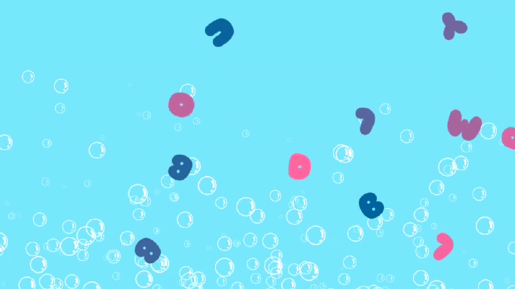
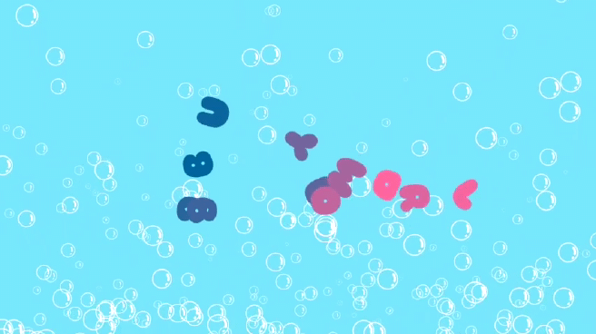
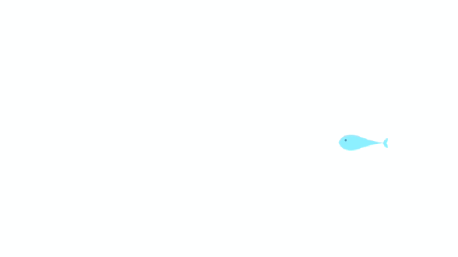
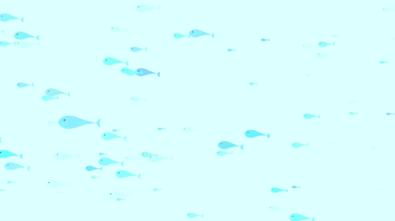
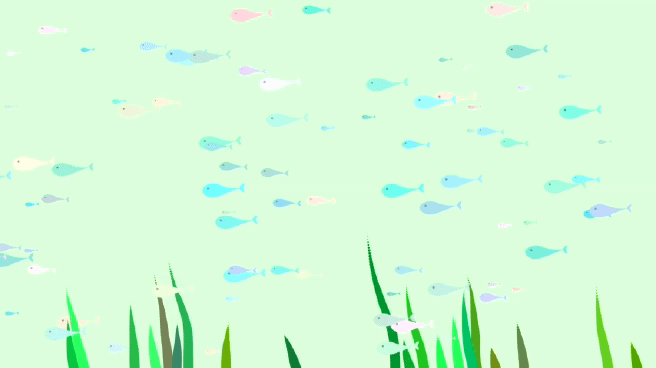
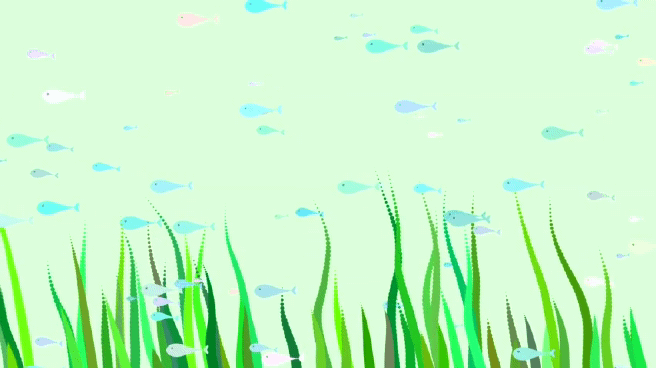
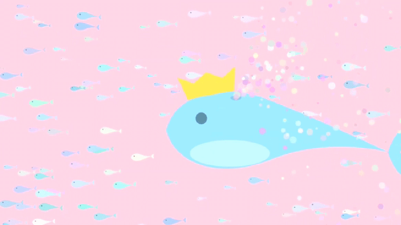
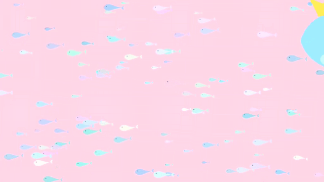

# Bubbly World 🐠
### Media Art Project using [Processing IDE](https://processing.org/) 
> `Bubbly world` is Java-coded media art, created using the processing IDE for about two months. 
> The main theme is`Under the Sea`, and the video consists of a total of 4 scenes. Some codes are based on open source from [openprocessing.org](https://openprocessing.org).   
     
You can see the [full version](https://youtu.be/oHxQvQRg3ZY) on the YouTube. 
 Please enjoy watching! (like 👍 and subscribe 😻)   
   

## Intro
</img>

</img>

 

## Fishes 
</img>

</img>

 

## Seaweeds
</img>

</img>

 

## King of the bubbly world 🐋
</img>

</img>
