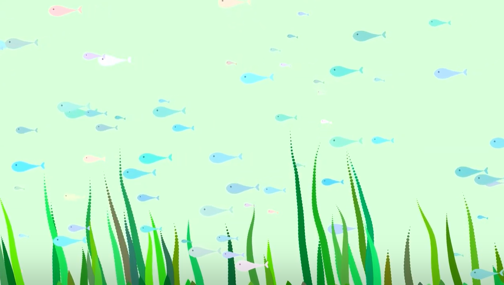

# Bubbly World
### Private Media Art Project using Processing
  **Bubbly world** is a purely Java-coded media art, created using the processing development environment for about two months. The main theme is 'Under the Sea', and I made up a total of 4 scenes. It is based on open source from openprocessing.org.   
     
You can see the full version on the YouTube. Please enjoy watching :)   
   
#### Video Link : https://youtu.be/oHxQvQRg3ZY

#### 1. title
</img>
#### 2. fishes
</img>
#### 3. seaweeds
</img>
#### 4. the king of bubbly world
</img>
